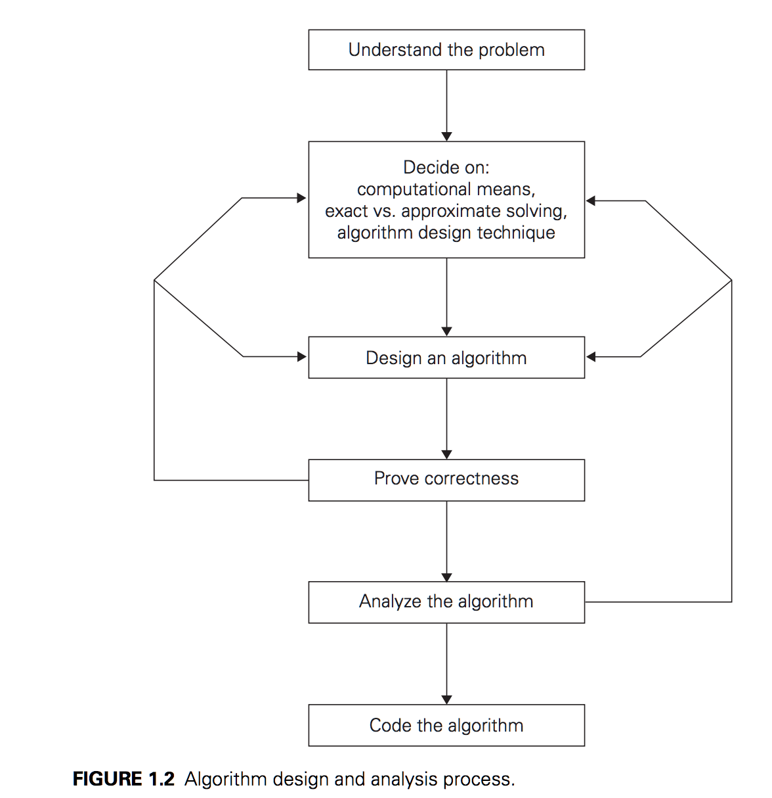

# Week 1 - Algorithms analysis and fundemental data structures

## What is an algorithm?

### 1. What is an algorithm and what are its characteristics? Are algorithms language-specific? Explain the derivation of the term “algorithm.”

- **What is an algorithm?**
  - Sequence of unambiguous instructions
  - Solves a problem
  - Obtains required output
  - Based on any legitimate input in a finite amount of time

- Algorithms are **not** language specific

- Comes from the latinisation of the name of some Arabic man :)

### 2. Given that the official purpose of the U.S. patent system is the promotion of the “useful arts,” do you think algorithms are patentable in this scountry? Should they be?

Depends on the perspective you look at it from!

### 3. 

#### a. Write down the steps for installing a television set in your home with the precision required from an algorithm’s description.

1. Place TV on cabinet
2. Plug chord into back of TV.
3. Plug plug into wall
4. Turn plug on
5. Turn TV on

#### b. Write down the steps for preparing tea with the precision required by an algorithm.

1. Get kettle
2. Open spout
3. Fill kettle with water for one cup
4. Turn off tap
5. Put kettle on gas top
6. Light flame
7. Waiting for water to boil
8. Turn off gas
9. Get cup
10. Get teabag
11. Put teabag in cup
12. Fill cup with water from kettle
13. Let brew for 3 minutes
14. Retrieve teabag
15. Get milk
16. Pour 10ml milk

### 4. Write an algorithm for sorting integer numbers in ascending order using any sorting technique. For example, the unsorted numbers are 23, 45, 12, 37, 11, 56 and the sorted numbers in ascending order are 11, 12, 23, 37, 45, 56.

```
numbers = [23, 45, 12, 37, 11, 56]

# [Bubble sort](https://www.geeksforgeeks.org/bubble-sort/) - swap adjacent numbers

for(i=0 i<numbers.length-1 i++) 
{
numbers[i] < numbers[i+1]? do nothing
else swap
swapcount++
}
repeat until swapcount = 0
```

### 5. Design an algorithm to find the sorted list from two sorted lists of numbers. For example, for the lists 2, 5, 7, 12, 13, 24 and 1, 6, 15, 17, 35, the output should be 1, 2, 5, 6, 7, 12, 13, 15, 17, 24, 35. What is the maximum number of comparisons your algorithm makes if the lengths of the two given lists are m and n, respectively?

```
a = [2, 5, 7, 12, 13, 24]
b = [1, 6, 15, 17, 35]

c = [1,2]
c = [1,2,5,6]
c = [1,2,5,6,7,15]
c = [1,2,5,6,7,15,12,17] 
c = [1,2,5,6,7,15,12,17, 13, 35, 24]

Bubble sort c from here (as above)

```


- Maximum number of comparisons is `(n)(m)`

### 6. 

#### a. Find gcd(31415, 14142) by applying Euclid’s algorithm.

```
31415 mod 14142 = 3131
14142 mod 3131 = 1618
3131 mod 1618 = 1513
1618 mod 1513 = 105
1513 mod 105 = 43
105 mod 43 = 19
43 mod 19 = 5
19 mod 5 = 4
5 mod 4 = 1
```

These two numbers are coprime.


#### b. Estimate how many times faster it will be to find gcd(31415, 14142) by Euclid’s algorithm compared with the algorithm based on checking consecutive integers from min{m, n} down to gcd(m, n).

A lot of difference in time!!!!

### 7. Prove the equality gcd(m, n) = gcd(n, m mod n) for every pair of positive integers m and n.

```
gcd(939, 866) = gcd (866, 79)

939 mod 866 = 79
866 mod 79 = 76
79 mod 76 = 3
76 mod 3 = 0
```

### 8. What does Euclid’s algorithm do for a pair of integers in which the first is smaller than the second? What is the maximum number of times this can happen during the algorithm’s execution on such an input?

- When first number is smaller, the algorithm swaps the 2 integers so that m is larger than n. 

- Once. If swapped initially, will not need to be swapped again.

### 9. 

#### a. What is the maximum number of divisions made by Euclid’s algorithm

Depends on size of number. 

#### b. What is the minimum number of divisions made by Euclid’s algorithm among all inputs 1 ≤ m, n ≤ 10?

1 ie. 10 mod 5 = 0

# Fundementals of algorithmic problem solving


